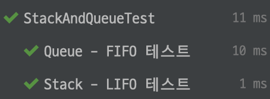

# 스택 vs 큐

## 스택(Stack)

- 후입선출 - LIFO(Last In First Out)
- 스택은 가장 마지막에 들어온 데이터를 먼저 삭제하는 자료구조이다.

### 대표 메서드

- push
- pop
- size
- isEmpty

### 활용 예시

- 웹 브라우저 뒤로가기
- 실행 취소(Undo)
- 후위 표기법
- 수식 괄호 계산
- DFS 알고리즘

### 코드 예시 - Java

```java
@DisplayName("Stack - LIFO 테스트")
@Test
public void stackTest() {
    Stack<Integer> stack = new Stack<>();
    stack.push(1);
    stack.push(2);
    stack.push(3);

    assertEquals(3, stack.size());
    assertEquals(3, stack.pop());
    assertEquals(2, stack.pop());
    assertEquals(1, stack.pop());
    assertTrue(stack.isEmpty());
}
```

<br>

## 큐(Queue)

- 선입선출 - FIFO(First In First Out)
- 큐는 데이터가 들어온 순서대로 사용하는 자료구조이다.

### 대표 메서드

- offer
- poll
- size
- isEmpty

### 큐 활용 예시

- 음식점, 카페 대기줄
- 프로세스 관리
- 캐시 구현
- BFS 알고리즘

### 코드 예시 - Java

```java
@DisplayName("Queue - FIFO 테스트")
@Test
public void queueTest() {
    Queue<Integer> queue = new LinkedList<>();
    queue.offer(1);
    queue.offer(2);
    queue.offer(3);

    assertEquals(3, queue.size());
    assertEquals(1, queue.poll());
    assertEquals(2, queue.poll());
    assertEquals(3, queue.poll());
    assertTrue(queue.isEmpty());
}
```

<br>


