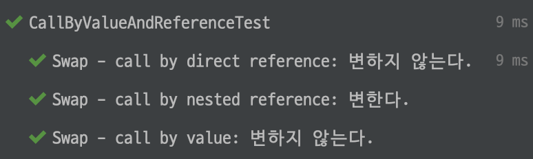

# Call by Value vs Call by Reference

## 함수 호출 방법

- Call by Value
- Call by Reference

<br>

## Call By Value(값에 의한 호출)

- 인자로 받은 값을 **복사**하여 처리한다.
- **복사를 해서 메모리 사용량이 늘어난다.**

<br>

## Call By Reference(참조에 의한 호출)

- 인자로 받은 주소를 참조하여 직접 값에 영향을 준다.
- **복사하지 않고 직접 참조를 해서 빠르다.**
- 직접 참조를 해서 위험이 있다.

<br>

### Java에서는?

Java에서 call by reference는 해당 객체의 주소값을 직접 남기는 것이 아닌 객체를 보는 또 다른 주소 값을 만들어서 넘긴다.

```java
public static void swapByReference(Integer a, Integer b) {
  Integer temp = a;
  a = b;
  temp = b;
}

@DisplayName("Swap - call by direct reference: 변하지 않는다.")
@Test
public void callByDirectReferenceTest() {
  int a = 1;
  int b = 2;
  swapByReference(a, b);
  assertEquals(1, a);
  assertEquals(2, b);
}
```

```java
static class CustomInt{
  int number;

  public CustomInt(int number) {
    this.number = number;
  }
}

public static void swapByNestedReference(CustomInt a, CustomInt b) {
  int temp = a.number;
  a.number = b.number;
  b.number = temp;
}

@DisplayName("Swap - call by nested reference: 변한다.")
@Test
public void callByNestedReferenceTest() {
	CustomInt a = new CustomInt(1);
  CustomInt b = new CustomInt(2);
  swapByNestedReference(a, b);
  assertEquals(2, a.number);
  assertEquals(1, b.number);
}
```



<br>

## 참고

- https://devlog-wjdrbs96.tistory.com/44
- https://codingplus.tistory.com/29
