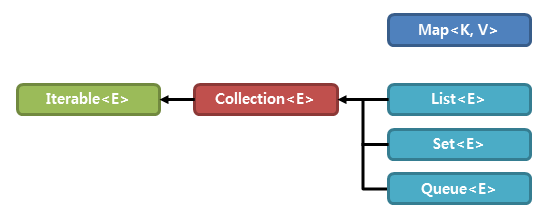

# Collection 프레임워크

자바에서 다수의 데이터를 쉽고 효과적으로 처리할 수 있는 표준화된 방법을 제공하는 클래스의 집합을 의미한다.
데이터를 저장하는 **자료 구조**와 데이터를 처리하는 **알고리즘**을 구조화하여 클래스로 구현되어 있다.
또한 객체들을 다루는 **일관된 API**를 제공함으로 **편리함**과 **성능 향상**을 제공한다.

 

### 주요 인터페이스

- List: 순서가 있는 목록
- Set: 순서와 중복이 없음
- Queue: 선입선출, FIFO
- _Map: Key-Value로 저장_

> Map은 Collection이 아닌 별도의 인터페이스로 선언되어 있다.

 

### Collection 구조

 

| 클래스        | 중복 | 순서 | 정렬 | 스레드 안전 |
| ------------- | ---- | ---- | ---- | ----------- |
| ArrayList     | O    | O    | X    | X           |
| LinkedList    | O    | O    | X    | X           |
| Vector        | O    | O    | X    | O           |
| HashSet       | X    | X    | X    | X           |
| LinkedHashSet | X    | O    | X    | X           |
| TreeSet       | X    | O    | O    | X           |
| HashMap       | X    | X    | X    | X           |
| LinkedHashMap | X    | O    | X    | X           |
| HashTable     | X    | X    | X    | O           |
| TreeMap       | X    | O    | O    | X           |

 

## 참고

- http://www.tcpschool.com/java/java_collectionFramework_concept
- https://en.wikipedia.org/wiki/Java_collections_framework
