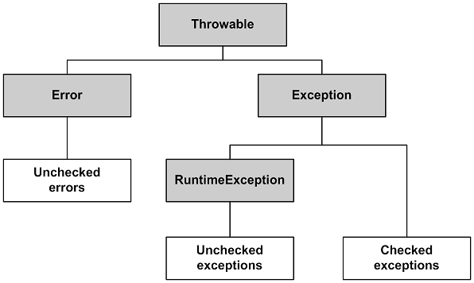
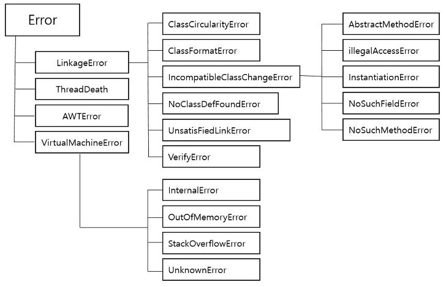
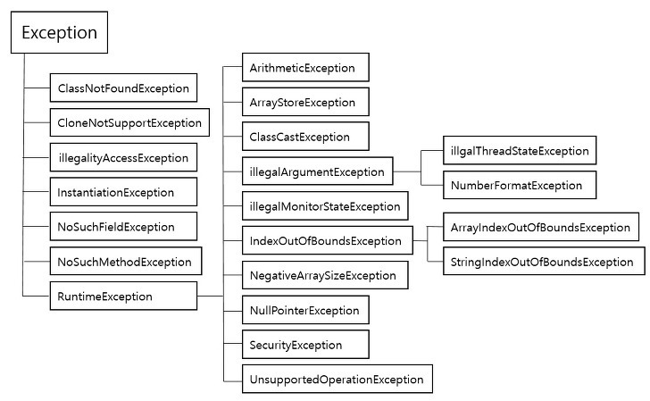

# Error & Exception

## Throwable

Throwable 클래스는 예외 처리를 할 수 잇는 최상위 클래스이다.

Error 클래스와 Exception 클래스의 상위 클래스로 `getMessage()`, `printStackTrace()` 같은 대표적인 메서드들이 정의되어 있다.

Error

- 에러는 시스템 레벨에서 프로그램에 심각한 문제를 야기해서 프로그램을 종료시킨다.
- 개발자가 예측하여 조치할 수 없다.

Exception

- 일반적으로 개발자가 구현한 로직에서 발생
- 개발자가 예외 발생 상황을 예측하여 조치할 수 있다.

 

## Error

> 의도치 않은 Error는 프로그램에 영향을 끼친다.

 

Compile Error

- 문법적인 오류나 문맥이 맞지 않는 코드를 작성하여 **컴파일 단계에서 발생하는 에러**
- **프로그램이 실행 불가**

Runtime Error

- **프로그램이 작동하면서 예기치 않은 상황에 의해 발생하는 에러**
- **프로그램이 오작동하거나 종료되는 현상 발생**

 

## Exception

> 의도치 않은 Exception은 스레드에 영향을 끼친다.

 

### Checked Exception vs Unchecked Exception

- Uncheked Exception: **RuntimeException**
- Checked Exception: 나머지

> **Unchecked?**
>
> 컴파일 시에 체크를 안해서

|           | Checked Exception             | Unchecked Exception                                                                                   |
| --------- | ----------------------------- | ----------------------------------------------------------------------------------------------------- |
| 처리여부  | 반드시 예외 처리 필요         | 필수는 아님                                                                                           |
| 확인시점  | 컴파일 단계                   | 실행 중                                                                                               |
| 트랜잭션  | Rollback X                    | Rollback                                                                                              |
| 대표 예외 | IOException SQLException | NullPointerException IllegalArgumentException IndexOutOfBoundException SystemException |

 

## 참고

- 자바의 신1

- https://sjh836.tistory.com/122
