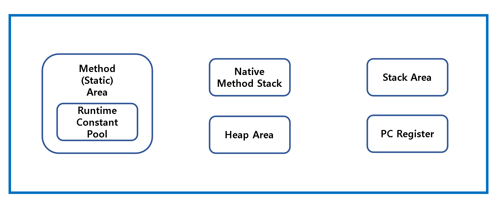

# 동일성 vs 동등성

동일성(Identity)은 두 객체의 **참조 값**을 비교하며 `==` 연산자로 확인할 수 있다.

동등성(Eqaulity)은 두 객체가 **같은 정보**를 갖고 있는지 비교하며, `equals()`로 확인할 수 있다.

<br>

### equals 메서드를 재정의 해야 하는 이유

`equals()`는 기본적으로 주소 값을 비교하도록 정의되어 있어서 `@Override`로 재정의하지 않으면 오직 자기 자신과만 같게 된다.

<br>

### equals 메서드를 재정의하지 않아도 되는 경우

- 각 인스턴스가 본질적으로 고유할 때
- 인스턴스의 '논리적 동등성'을 검사할 일이 없을 때
- 상위 클래스에서 재정의한 `equals()`가 하위 클래스에도 들어맞을 때
- 클래스가 private이거나 package-private이고 `equals()`를 호출할 일이 없을 때

<br>

### 양질의 equals 메서드 구현 방법

1. `==` 연산자를 사용해 입력이 **자기 자신의 참조인지 확인**한다.
2. `instanceof` 연산자로 입력이 **올바른 타입인지 확인**한다.
3. 입력을 올바른 타입으로 **형변환**한다.(2번에서 `instanceof` 검사를 했으니 100% 성공한다.)
4. 입력 객체와 자기 자신의 대응되는 **'핵심' 필드들이 모두 일치하는지 하나씩 검사**한다.
5. **equals를 재정의할 땐 `hashCode`도 반드시 재정의한다**

```java
public class Employee {
    private Long id;
    private int age;

    public Long getId() {
        return id;
    }

    public int getAge() {
        return age;
    }

    @Override
    public boolean equals(Object o) {
        if (o == this) {
            return true;
        }

        if (o == null || !(o instanceof Employee)) {
            return false;
        }

        if (getClass() != o.getClass()) {
            return false;
        }

        Employee e = (Employee) o;

        if (age != e.age) return false;
        return (id == e.getId());
    }

    @Override
    public int hashCode() {
        int result = age;
        result = 31 * result + id;
        return result;
    }
}
```

<br>

### Q) 기본 자료형은 참조형이 아닌데 `==`을 통해 값 비교가 가능한 이유?

변수 선언부는 Java Runtime Data Area의 Stack 영역에 저장이 되고, 해당 변수에 저장된 상수는 Runtime Constant Pool에 저장된다. 즉, Stack의 변수는 Runtime Constant Pool의 주소 값을 갖게 된다.

**따라서 기본 자료형도 사실상 주소 값을 비교하는 것이다.**

#### JVM - Runtime Data Area



<br>

## 참고

- Effective Java
- https://jisooo.tistory.com/entry/java-hashcode%EC%99%80-equals-%EB%A9%94%EC%84%9C%EB%93%9C%EB%8A%94-%EC%96%B8%EC%A0%9C-%EC%82%AC%EC%9A%A9%ED%95%98%EA%B3%A0-%EC%99%9C-%EC%82%AC%EC%9A%A9%ED%95%A0%EA%B9%8C
