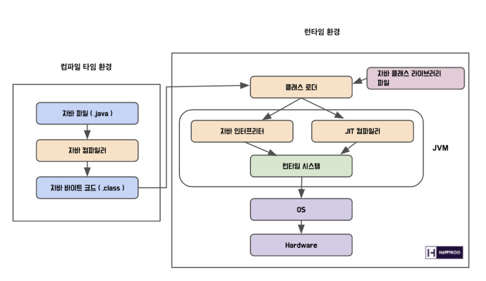

# Java 애플리케이션 실행 과정

- 프로그램을 실행하면 JVM은 OS로부터 메모리를 할당받는다.
- 자바 컴파일러(javac)가 소스 코드(.java)를 바이트 코드(.class)로 변환한다.
- JVM의 클래스 로더가 변환된 바이트 코드를 JVM으로 로딩한다.
- 로딩된 클래스 파일들은 실행 엔진(Execution Engine)을 통해 해석된다.
- 해석된 클래스 파일들은 Runtime Data Area에 배치되어 실질적인 수행이 이루어진다.

 

## 📚 References
- 유튜브 - [개발자 전공 면접 - 5. 자바](https://www.youtube.com/watch?v=VE_CDb00bc0)
- 블로그 - [[Java] 자바코드가 실행되는 과정에 대해 알아보자](https://blog.happykoo.net/@happykoo/posts/242)
