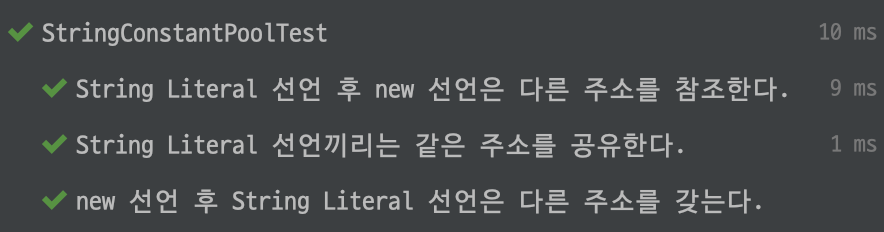

# String vs StringBuilder vs StringBuffer

|               | 가변성 | 동기화 지원 |
| ------------- | ------ | ----------- |
| String        | X      | O           |
| StringBuilder | O      | X           |
| StringBuffer  | O      | O           |

> 상황에 맞는 문자열 클래스로 선언해야 성능 저하를 피할 수 있다.

<br>

### String 특징

String 객체는 조회만 가능하고 변경할 수 없는 **불변(immutable)** 속성을 가진다.

`=`, `+` 연산이나 `.concat()`을 이용해서 문자열에 변화를 주면 기존 값을 버리고 새로 할당된다.

따라서 새로운 인스턴스가 생성되어 메모리를 차지하게 되므로 연산 횟수를 줄이는 것이 좋다.

<br>

### String 생성 방법

1. String literal, `" "`
2. `new` 연산자

#### String Constant Pool

String literal로 생성하면 해당 문자열은 Heap 영역 내 **String Constant Pool**에 저장되어 재사용되지만,
`new` 연산자로 생성하면 여러 개의 객체가 각각 Heap 영역을 차지하게 된다.

<br>

## 비교

### String

단순 문자열 참조, 탐색, 검색을 자주할 때 좋다.

```java
// String string = new String("B");
String string = "B";
string = string.concat("y");
string = string.concat("e");
```

### StringBuilder

단일 스레드 환경에서 반복적인 문자열 추가 연산이 많을 때 좋다.

```java
StringBuilder stringBuilder = new StringBuilder("B");
stringBuilder.append("y");
stringBuilder.append("e");
```

### StringBuffer

멀티 스레드 환경에서 반복적인 문자열 추가 연산이 많을 때 좋다.

```java
StringBuffer stringBuffer = new StringBuffer("B");
stringBuffer.append("y");
stringBuffer.append("e");
```

<br>

<hr>

<br>

### `new` 연산자로 선언한 문자열은 String Constant Pool에 저장되지 않는다.

```java
public class StringConstantPoolTest {
    // intern() 메서드를 활용하면 Java String Pool에 존재하는 String을 가져올 수 있다.
    @DisplayName("String Literal 선언끼리는 같은 주소를 참조한다.")
    @Test
    public void checkBetweenStringLiteral() {
        String declareByStringLiteral1 = "Hello";
        String declareByStringLiteral2 = "Hello";
        assertEquals(System.identityHashCode(declareByStringLiteral1), System.identityHashCode(declareByStringLiteral2));
    }

    @DisplayName("String Literal 선언 후 new 선언은 다른 주소를 참조한다.")
    @Test
    public void checkStringLiteralAndNew() {
        String declareByStringLiteral = "Hello";
        String declareByNew = new String("Hello");
        assertNotEquals(System.identityHashCode(declareByStringLiteral), System.identityHashCode(declareByNew));
    }

    @DisplayName("new 선언 후 String Literal 선언은 다른 주소를 갖는다.")
    @Test
    public void checkNewAndStringLiteral() {
        String declareByNew = new String("Hello");
        String declareByStringLiteral = "Hello";
        assertNotEquals(System.identityHashCode(declareByStringLiteral), System.identityHashCode(declareByNew));
    }
}
```



<br>

## 참고

- https://github.com/HyeminNoh/Tech-Stack/blob/master/docs/Java/String.md

- https://starkying.tistory.com/entry/what-is-java-string-pool
