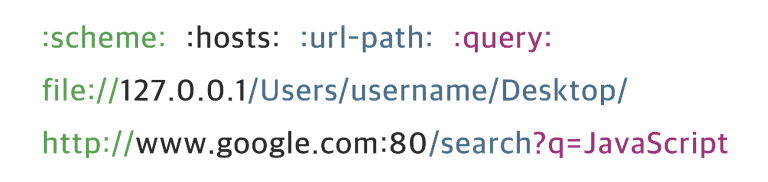

# URI & URL & URN

 

## URI(Uniform Resource Identifier)

- URL과 URN의 상위 개념이다.
- 인터넷 상에 **자원을 식별할 수 있는 문자열**을 의미한다.

 

## URL(Uniform Resource Locator)

- URL은 네트워크 상에서 리소스에 대한 구체적인 위치를 의미한다.
- 특정 시점에 자원의 위치를 의미해서, 자원이 이동하면 찾을 수 없게 된다. **(URL의 한계)**

 

### URL 구조

- scheme: 사용할 프로토콜(웹에서는 http, https를 사용)
- user, password: (서버에 있는) 데이터에 접근하기 위한 사용자의 이름과 비밀번호
- host, port: 접근할 대상(서버)의 호스트명과 포트번호
- path: 접근할 대상(서버)의 경로에 대한 상세 정보
- query: 접근할 대상에 전달하는 추가적인 정보(파라미터)
- fragment: 메인 리소스 내에 존재하는 서브 리소스에 접근할 때 이를 식별하기 위한 정보

 

## URN(Uniform Resource Name)

- 이름으로 리소스를 식별하는 URI이다.
- 실제 자원을 찾기 위해서는 URN을 URl로 변환하여 사용한다.
- URL의 한계를 개선하고자 착수됐지만 아직 표준이 되지 못했다.

 

## 참고

- https://velog.io/@sxxk2/CS-URI-URL-URN
- https://velog.io/@younoah/uri-url-urn
